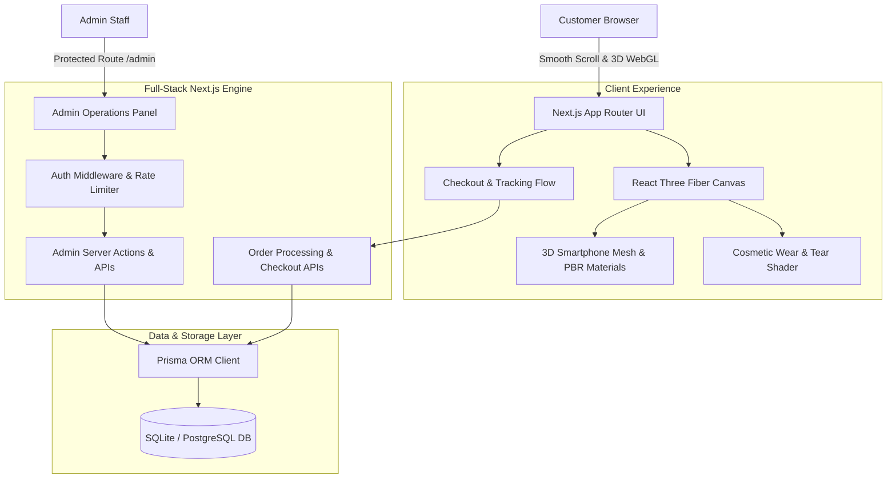

# 3D Used Smartphone E-Commerce Platform - Design Document

**Date:** 2026-10-07  
**Status:** Approved  
**Author:** Antigravity & User  

---

## 1. Executive Summary

This platform is a high-performance, immersive direct-to-consumer e-commerce application for selling certified used and refurbished smartphones. 

The application combines:
1. **Apple-Grade 3D Web Experience**: Butter-smooth 60+ FPS interactive 3D smartphone models with scroll-driven camera choreography, component exploded views (chip, camera, battery), and a real-time cosmetic condition simulator (**Pristine**, **Good**, **Fair**).
2. **Secure Admin Operations Suite**: Role-based authentication, individual unit IMEI/serial tracking, diagnostic data entry (battery health %, cosmetic grading), real-time inventory management, and an end-to-end order processing pipeline (from inspection to shipment and customer tracking).
3. **Robust Security & Performance**: Bcrypt password hashing, HTTP-only JWT cookies, route middleware protection, rate limiting, and Zod input sanitization.

---

## 2. System Architecture

---

## 3. Frontend & 3D Interactive Animation Engine

### 3.1 3D Smartphone Mesh & Material Specs
* **Chassis & Frame**: Metallic PBR material (`meshStandardMaterial` / `MeshPhysicalMaterial`) with roughness maps simulating titanium and matte anodized aluminum.
* **OLED Screen & Dynamic UI**: Glass transmission layer over an emissive canvas plane rendering simulated smartphone screen graphics (battery status, network icon, wallpaper, diagnostic benchmarks).
* **Triple Camera Array**: Multi-layer mesh with sapphire glass reflections, individual focal rings, and depth layering.
* **Internal Diagnostic Layer (Exploded View)**:
  * High-density logic board with microchip markings (e.g., A-series / Snapdragon).
  * Graphite thermal dissipation sheet.
  * Lithium-ion battery pack with verified capacity text.
  * Taptic engine and speaker module.

### 3.2 Scroll Choreography & GSAP ScrollTrigger
* **Hero (0% - 25% Scroll)**: Floating phone with mouse-tracking gyro tilt and subtle breathing physics.
* **Exploded Architecture (25% - 55% Scroll)**: Rear glass separates along Z-axis; battery, logic board, and camera elements displace outward smoothly to demonstrate 50-point refurbishment diagnostics.
* **360° Inspection (55% - 80% Scroll)**: Components reassemble; phone rotates 360 degrees to showcase ports, buttons, and pristine edge symmetry.
* **Condition Grade Simulator (80% - 100% Scroll)**:
  * Users can click condition buttons:
    * **Pristine Grade**: Flawless reflections, 0 visible scratches ($100\%$ cosmetic condition).
    * **Good Grade**: Micro-abrasions along corner bevels, screen remains immaculate.
    * **Fair Grade**: Observable surface scuffs on rear and perimeter, discounted price.
* **Smooth Scrolling Engine**: Integrated `@studio-freight/lenis` providing momentum-based butter-smooth scroll scrubbing synchronized with GSAP timelines.
* **Performance Guardrails**:
  * Pixel ratio bounded between `1.0` and `1.8` (`dpr={[1, 1.8]}`).
  * Frustum culling and geometry reuse to eliminate unnecessary draw calls.
  * Graceful WebGL context-lost listener with automatic re-initialization.

---

## 4. Backend & Database Design (Prisma ORM)

### 4.1 Schema Definition

#### `Product` (Catalog Master)
* `id`: String (UUID / CUID, Primary Key)
* `brand`: String (`Apple`, `Samsung`, `Google`)
* `modelName`: String (`iPhone 15 Pro`, `Galaxy S24 Ultra`, etc.)
* `slug`: String (Unique)
* `basePrice`: Float
* `description`: String
* `specsJson`: String / JSON (Display, Chipset, Camera, Weight)
* `isFeatured`: Boolean
* `createdAt`, `updatedAt`: DateTime

#### `DeviceInventoryItem` (Individual Stock Unit)
* `id`: String (Primary Key)
* `productId`: String (Foreign Key -> `Product.id`)
* `imeiOrSerial`: String (Unique)
* `storage`: String (`128GB`, `256GB`, `512GB`, `1TB`)
* `color`: String (`Natural Titanium`, `Phantom Black`, `Titanium Blue`, etc.)
* `conditionGrade`: Enum (`PRISTINE`, `GOOD`, `FAIR`)
* `batteryHealth`: Int (e.g., `96` for 96%)
* `carrierLock`: String (`Unlocked`, `Factory Unlocked`)
* `salePrice`: Float
* `stockStatus`: Enum (`AVAILABLE`, `RESERVED`, `SOLD`)
* `inspectionNotes`: String
* `createdAt`, `updatedAt`: DateTime

#### `Order` & `OrderItem`
* `id`: String (Primary Key)
* `orderNumber`: String (Unique, e.g. `SW-2026-XXXX`)
* `customerName`: String
* `customerEmail`: String
* `customerPhone`: String
* `shippingAddress`: String
* `totalAmount`: Float
* `paymentMethod`: Enum (`STRIPE_CARD`, `CASH_ON_DELIVERY`, `BANK_TRANSFER`)
* `paymentStatus`: Enum (`PENDING`, `PAID`, `FAILED`)
* `orderStatus`: Enum (`PENDING_REVIEW`, `DIAGNOSTIC_PACKAGING`, `SHIPPED`, `DELIVERED`, `CANCELLED`)
* `carrierTrackingNumber`: String (Optional)
* `items`: Relation to `OrderItem[]`
* `createdAt`, `updatedAt`: DateTime

#### `AdminUser`
* `id`: String (Primary Key)
* `email`: String (Unique)
* `passwordHash`: String (Bcrypt salt rounds: 12)
* `fullName`: String
* `role`: Enum (`SUPER_ADMIN`, `OPERATIONS_MANAGER`)
* `failedLoginAttempts`: Int (Default 0)
* `lockedUntil`: DateTime (Optional)
* `createdAt`, `updatedAt`: DateTime

---

## 5. Admin Panel & Order Processing Workflow

### 5.1 Admin Authentication & Route Protection
* Login route: `/admin/login`.
* Route Guard: Next.js Edge Middleware checks for valid signed JWT in secure HTTP-only cookie `admin_session`.
* Unauthorized attempts redirect immediately to `/admin/login`.
* Rate limiter throttles IP to 5 attempts per 15 minutes to eliminate brute force attacks.

### 5.2 Device Data Entry Studio (`/admin/inventory`)
* **Rapid Entry Form**:
  * Select device catalog model.
  * Enter scanned IMEI/Serial with duplicate validation.
  * Input hardware diagnostics (Battery health percentage, screen status, audio/mic test).
  * Select cosmetic grade and assign price.
* **Inventory Control**: Live status toggle (`Available` $\rightarrow$ `Sold`), price adjustment, and batch status filters.

### 5.3 Order Processing Pipeline (`/admin/orders`)
* Order Status State Machine:
  1. **Pending Review**: Validates shipping details and payment record.
  2. **Device Quality Inspection & Packaging**: Physical unit matched by IMEI, test report printed.
  3. **Dispatched / Shipped**: Shipping carrier and tracking code recorded; updates public order tracking record.
  4. **Delivered**: Order completed and archived.
* One-click downloadable/printable Refurbishment Certificate & Invoice.

### 5.4 Customer Order Tracker (`/track-order`)
* Public lookup interface requiring only Order Number + Customer Email.
* Visual timeline showing progress through testing, packaging, courier dispatch, and delivery.

---

## 6. Security & Hardening Measures

1. **Password Security**: Bcrypt with work factor 12.
2. **Session Security**: JWT signed with server secret (`HS256`/`RS256`), stored strictly in `httpOnly`, `Secure`, `SameSite=Strict` cookies.
3. **Data Sanitization**: All incoming requests validated via Zod schemas; SQL injections prevented through Prisma parameterized queries.
4. **HTTP Security Headers**: `X-Frame-Options: DENY`, `X-Content-Type-Options: nosniff`, `Referrer-Policy: strict-origin-when-cross-origin`.
5. **Masking Sensitive Data**: Customer interfaces only display last 4 digits of IMEI numbers to prevent serial harvesting.

---

## 7. Verification & Acceptance Criteria

1. **3D Scene Verification**: 3D phone canvas renders cleanly without WebGL warnings, maintains 60+ FPS, supports 360-degree rotation, and updates cosmetic condition on toggle.
2. **Scroll Choreography**: Exploded view disassembles and reassembles in lockstep with page scrolling.
3. **Admin Security Test**: Direct unauthenticated requests to `/admin`, `/admin/inventory`, and `/admin/orders` return 401/redirect; authenticated sessions pass.
4. **Data Entry & Inventory Test**: Admin can create a new device unit, see it in inventory, and verify it appears in the storefront catalog.
5. **Order Lifecycle Test**: Customer places order $\rightarrow$ Order appears in admin pipeline $\rightarrow$ Admin advances status to Shipped with tracking number $\rightarrow$ Customer order tracking updates accurately.
